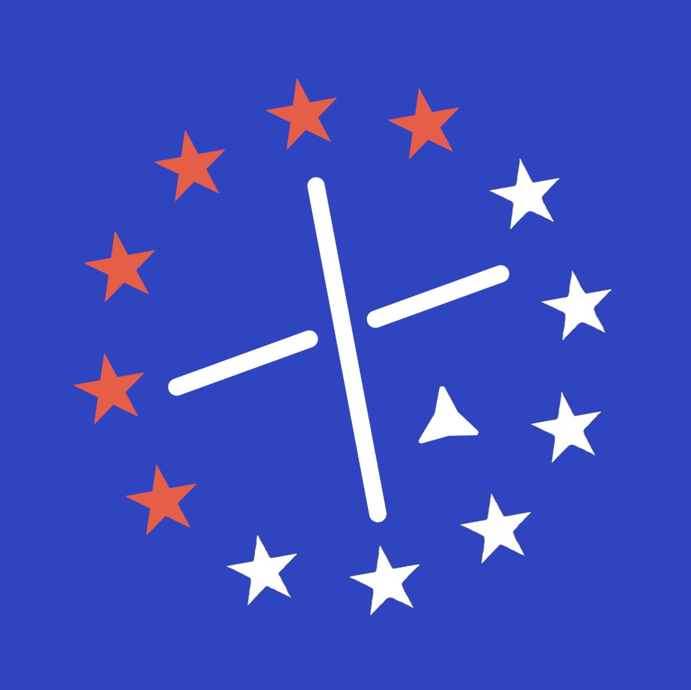

#wip

<figure>

<figcaption>The main logo of Confoederatio, also known as <i>The Hansard</i>. Note the slight tilting of the stars.</figcaption>
</figure>

**Confoederatio** is a standalone data science studio focusing on foundational infrastructure and complex datasets that was formed as a merger of the collective efforts of **11:59's Development Team**, **Boomsbury**, **Cats and Vultures**, **Midnight**, and **Confoederatio Studios**. Confoederatio currently manages ~30 active projects over four separate divisions, including the Preservés with work on technical and scientific tooling as well as arts and culture.

Note that documentation on this site is currently in the process of being migrated from older websites as well as physical documents. If there are any missing pieces of documentation that you are in need of, please contact members of Confoederatio responsible for that project directly.

## History

- Main article: [[History of Confoederatio]]
## Organisation

All members of Confoederatio are pseudonymous with varying levels of affiliation. They must publish projects under these pseudonyms. Only full members of Confoederatio are listed as personnel, with them being flexibly divided between four divisions: Confoederatio, Artistic Division (**CAD**), which manages UI/UX; Confoederatio, Research Division (**CRD**), which manages applied research; and Confoederatio, Technical Division (**CTD**), which mainly works on games and backend frameworks.

## Logo Descriptions

**The Hansard.** <ins>(Confederal Logo).</ins>
12 stars in a circle, 6 red (NW), 6 white (SE), angled varyingly between 0-23,5 degrees (to suggest imperfection), set on a tory blue field, with the Southern Cross in the centre.

Drawing a line north from Silicon Valley, and stopping over the North Pole; if the Earth were transparent, this would be the symbolic view received. On the NW side, China receives 5 red stars (per its flag), and Russia 1 red star (per the ex-Soviet Union's flag), per the logic of primacy. On the SE side, the US receives 1 white star (per common depiction), and the EU 5 white stars (for the Western Union), per the logic of equality. The blue field is representative of this Blue Marble.

In short, it represents the world as it is.

**CAD.** A unicorn rampant with the North Star above it.
**CRD.** A lion rampant being buried in paper.
**CTD.** A vulture grabbing scrolls out of barbed wire.
## Personnel

Confoederatio has only two full members at the moment: Vis Tacitus (VIs), and Aust Kätzchen (Aust). Their contacts can be reached as follows:

- Aust Kätzchen
	- Discord: australis_
	- Email: [austkaetzchen@confoederatio.org](mailto:austkaetzchen@confoederatio.org)
- Vis Tacitus
	- Discord: vistacitus
	- Email: [vistacitus@confoederatio.org](mailto:vistacitus@confoederatio.org)

## Publications and Software

Publications are covered under **CRD**, whilst software is split between CRD for research tooling and **CTD** for technical frameworks and game/software engine development. All publications and software are open-source and freely available on GitHub underneath an MIT Licence.

## Yearly Plans

2026: [[Confoederatio26]]