

An ongoing project on the full documentation of all projects managed by Confoederatio and their histories. 
<i><u>Verc et haut et svargestent!</i></u>  

	

**[[FAQs]]** | **[[Projects]]** | **[[Confoederatio|More About Confoederatio >]]**

---
# Introduction

Confoederatio is a comprehensive R&D studio focused on the production of scientific tooling, technical infrastructure, complex strategy/simulation games, and applied knowledge and modelling. It is split into three main divisions: Confoederatio, Artistic Division (CAD); Confoederatio, Research Division (CRD); and Confoederatio, Technical Division (CTD). The physical and digital holdings of historical and scientific documents are covered under the _Preservés des Confoederatio_ or _Preservés_ generally. These documents are outlined in the given gazetteer.

All datasets and documents, alongside accompanying research notes and code, are made available in the public interest even if they may not be fully documented. This website is currently under construction; and as such, some fundamental projects may currently be missing documentation.

---
<table>
	<tr><td style = "padding:0;border:0;" width = "50%">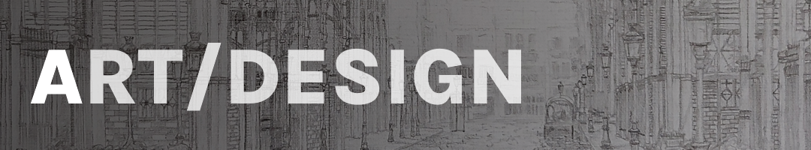</td><td style = "padding:0;border:0;padding-left: 0.25rem;" width = "50%">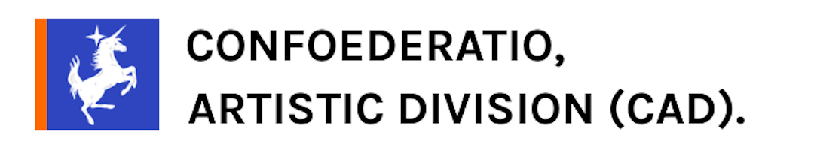</td></tr>
	<tr><td style = "padding:0;border:0;" width = "50%"></td><td style = "padding:0;border:0;padding-left: 0.25rem;" width = "50%"><a href = "https://www.deviantart.com/australiszero">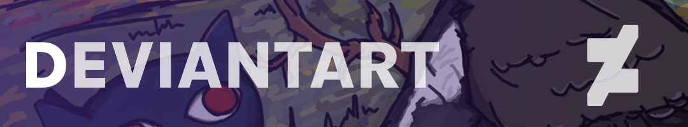</a></td></tr>
	<tr><td style = "padding:0;border:0;" width = "50%"></td><td style = "padding:0;border:0;padding-left: 0.25rem;" width = "50%"></td></tr>
</table>

<table>
	<tr><td style = "padding:0;border:0;" width = "50%">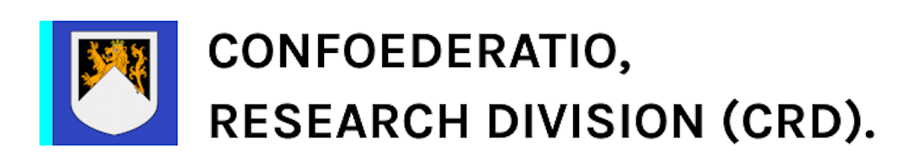</td><td style = "padding:0;border:0;padding-left: 0.25rem;" width = "50%">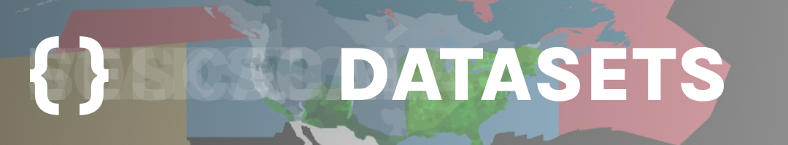</td>
	<tr><td style = "padding:0;border:0;" width = "50%">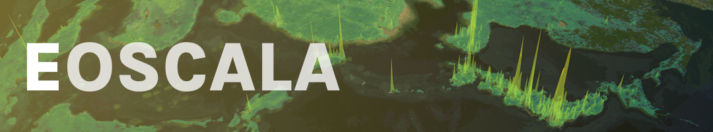</td><td style = "padding:0;border:0;padding-left: 0.25rem;" width = "50%">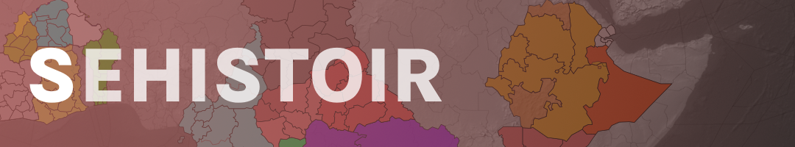</td></tr>
	<tr><td style = "padding:0;border:0;" width = "50%">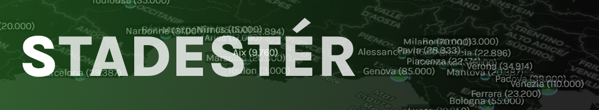</td><td style = "padding:0;border:0;padding-left: 0.25rem;" width = "50%">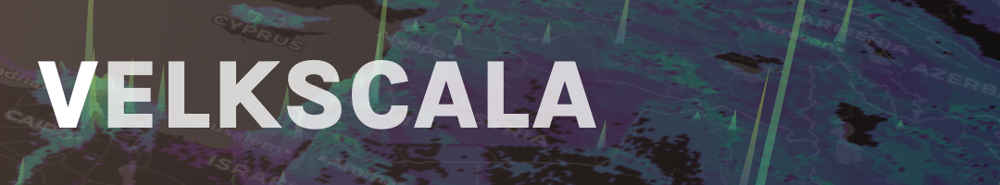</td></tr>
	<tr><td style = "padding:0;border:0;" width = "50%"></td><td style = "padding:0;border:0;padding-left: 0.25rem;" width = "50%">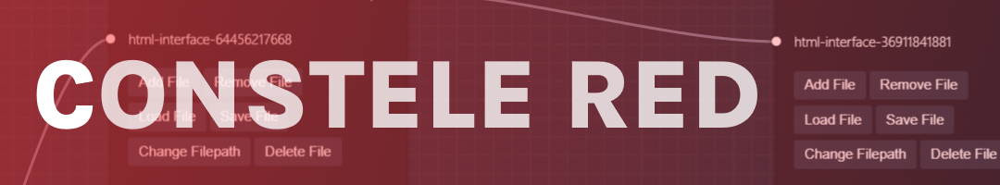</td></tr>
	<tr><td style = "padding:0;border:0;" width = "50%"><a href = "https://confoederatiodocs.info/CRD+(Confoederatio%2C+Research+Division)/Documentation/Software/Naissance+HGIS/Naissance+HGIS">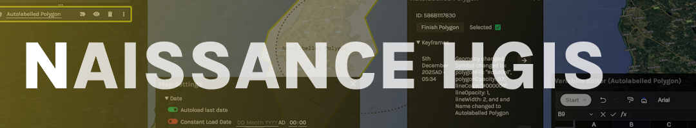</a></td><td style = "padding:0;border:0;padding-left: 0.25rem;" width = "50%"></td></tr>
</table>

<table>
<tr><td style = "padding:0;border:0;" width = "50%"></td><td style = "padding:0;border:0;padding-left: 0.25rem;" width = "50%"></td>
<tr><td style = "padding:0;border:0;" width = "50%"></td><td style = "padding:0;border:0;padding-left: 0.25rem;" width = "50%"></td>
</table>

<h4>Subnavigation by Division:</h4>

**CAD**:
- Artwork: [[Graphic Design]] | [[Icons and Assets]] | [[Traditional Art]]
- Digital Projects: [[G-Earth.MC]]
- Web Presence: [[Confoederatio Website]]

**CRD**:
- Datasets: [[Atlas]] | [[Eoscala]] | [[Sehistoir]] | [[Stadestér]] | [[Velkscala]]
- Software: [[Constele Red]] | [[Naissance HGIS]] 
- Legacy (Software): [[Naissance]] | [[Project Humanity]]

**CTD**:
- Game Engines: [[Analytical Engine]] | [[Gamechanger]]
- Games/Game-related Projects: [[Balance of Power]] | [[Triumph & Tragedy II]]
- Technical Projects: [[UF]] | [[Vercengen]]
- Legacy (Games): [[11.59 (AOC2)]] | [[11.59 (AOC3)]] | [[Triumph & Tragedy I]]
- Legacy (Technical Projects): [[BrowserUI]] | [[Legacy Geospatiale]] | [[Legacy UF]] | [[Scriptly IDE]]

**Preservés des Confoederatio**:
- Digital Archives: [[Digital Archives]]
- Physical Archives: [[Physical Archives]]